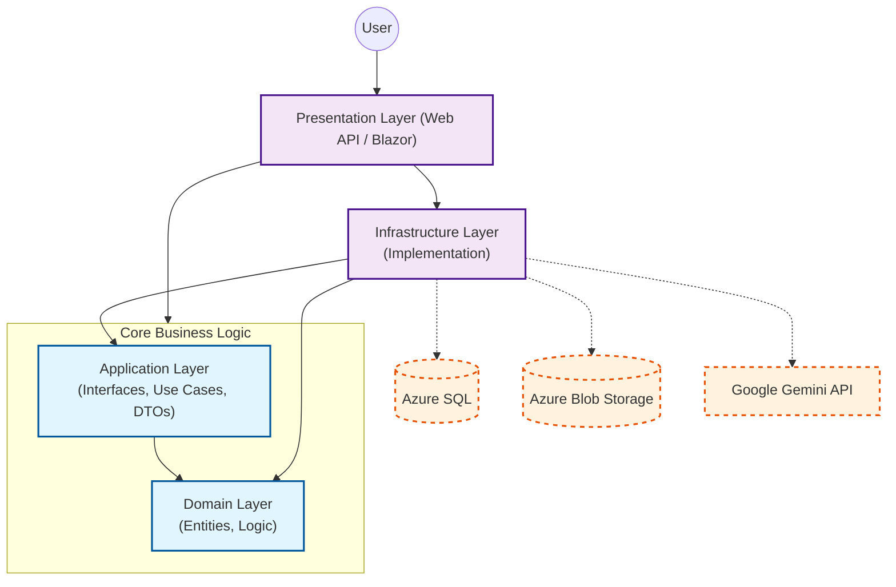

🚀 CareerOps
Enterprise Career CRM & AI-Driven Analytics Platform
Architected for Scalability, Multi-tenancy, and Data-Driven Job Searching.

📋 Project Overview
CareerOps is a modern, cloud-native Career CRM designed to give candidates telemetry and strategic control over their job search. It moves beyond traditional "apply and pray" methods by leveraging Generative AI to analyze resumes against job descriptions, providing actionable gap analysis and A/B testing insights.

This project serves as a comprehensive engineering portfolio demonstrating a Senior-level architecture suitable for the European Enterprise market. It strictly adheres to Clean Architecture, Domain-Driven Design (DDD) principles, and SaaS Multi-tenancy strategies.

🎯 Key Goals
Architecture First: Demonstrate a robust Modular Monolith ready for microservices and data pipelines extraction.

FinOps Oriented: Architecture optimized for low cloud costs using efficient AI models (Gemini 2.5 Flash) and local text processing.

Privacy by Design: GDPR-compliant architecture with strict data isolation per tenant and audit trails.

🏗️ Architecture
The solution follows Clean Architecture principles to ensure separation of concerns, testability, and adherence to the Dependency Inversion Principle.

🧠 Architectural Decisions
Modular Monolith: Organized by Bounded Contexts to reduce cognitive load and prepare for event-driven extraction.

Multi-tenancy: Implemented via EF Core Global Query Filters (OwnerId), ensuring logical data isolation at the database level.

Soft Delete & Audit: Audit-compliant data removal using Shadow Properties (IsDeleted), keeping the Domain Entities clean.

Architecture Governance: Automated tests using NetArchTest to prevent architectural drift (e.g., ensuring Domain never depends on Infrastructure).

🛠️ Tech Stack
Backend (.NET 8)
Core: ASP.NET Core Web API, C# 12

Data Access: Entity Framework Core 8 (Code-First)

Validation & Mapping: FluentValidation, AutoMapper

Resilience & Observability: Polly v8, OpenTelemetry, Serilog

Frontend (Blazor)
Framework: Blazor WebAssembly (WASM) hosted on ASP.NET Core.

UI Library: MudBlazor (Material Design Components).

AI, Cloud & Data
LLM Orchestration: Microsoft Semantic Kernel.

Model: Google Gemini 2.5 Flash (Selected for state-of-the-art speed, massive context window, and FinOps efficiency).

Text Extraction: PdfPig (Local extraction to bypass expensive OCR Cloud Services).

Identity: Microsoft Entra External ID (Azure AD B2C).

💡 Key Features
1. Intelligent Job Matching (AI Telemetry)
Unlike standard keyword matching, CareerOps uses Semantic Analysis to understand the intent of a job description. It provides a "Match Score" and identifies specific skill gaps between the candidate's resume and the market demands.

2. Enterprise-Grade Security
Zero-Trust Auth: No local passwords. Authentication via Google/Microsoft accounts handled by Azure AD B2C.

Tenant Isolation: Deep integration of OwnerId filters in the ORM pipeline ensures zero cross-tenant data leakage.

3. FinOps & Performance Strategy
Pre-processing: PDFs are parsed locally (CPU), sending only pure extracted text to the LLM.

Context Window Optimization: Using Gemini 2.5 Flash allows for evaluating multiple resumes simultaneously for A/B testing at a fraction of traditional LLM costs.

🚀 Getting Started
Prerequisites
.NET 8 SDK

SQL Server (LocalDB or Docker)

Google AI API Key (Gemini)

Installation
Clone the repo

git clone https://github.com/your-username/career-ops.git
cd career-ops
Configure User Secrets (Security)

dotnet user-secrets set "ConnectionStrings:DefaultConnection" "Your_ConnectionString"
dotnet user-secrets set "AI:GeminiApiKey" "Your_Gemini_Key"
Run Migrations & Start

cd src/CareerOps.Infrastructure
dotnet ef database update --startup-project ../CareerOps.API
cd ../CareerOps.API
dotnet run

🛣️ Roadmap: The Data Engineering Pivot (V2)
The project is currently evolving from a transactional CRM to an Event-Driven Data Product.

[x] Phase 1: MVP (Clean Arch, Basic CRUD, Multi-tenancy, Blazor UI)

[ ] Phase 2: Event-Driven Architecture: Implement Azure Service Bus to decouple transactional operations from AI processing.

[ ] Phase 3: Data Engineering (Python): Offload AI analysis and ETL/ELT processes to Python-based Azure Functions, preparing for advanced analytics.

[ ] Phase 4: Advanced Dashboards: Introduce A/B testing for resumes and market trend analysis (Skill Gap Radar) based on aggregated data.

🤝 Contribution & License
This project is part of a Professional Engineering Portfolio demonstrating readiness for Senior .NET and Data-oriented roles. Code reviews, architectural feedback, and PRs are welcome.

License: MIT

Contact: [Maercio Paulino de Sousa] - [https://www.linkedin.com/in/maercio-paulino/]
